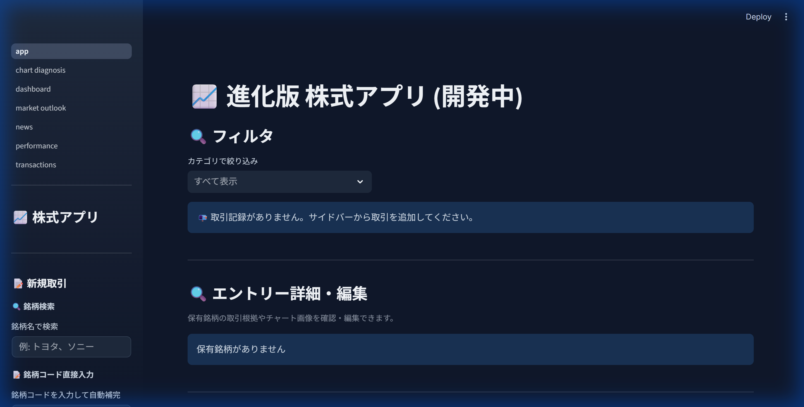
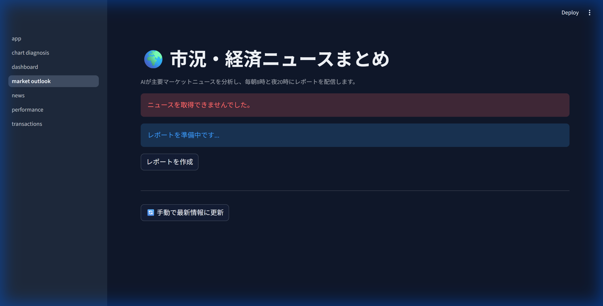

# 📈 Stock Portfolio & Analysis App

日本株式対応のポートフォリオ管理アプリ。リアルタイムの株価取得、AI診断機能、独自のテクニカル分析判断ツールを搭載しています。

## 📱 アプリケーション画面


*(メインダッシュボード：ポートフォリオのパフォーマンスと取引履歴を可視化)*


*(AI市況分析：毎日のニュースからマーケットの動向を最新のAIモデルが自動生成)*

## 💡 開発の目的（Why）

**「既存の株管理アプリでは自身の投資スタイルに合わず、独自の分析指標や記録を手軽に残したかったため」**

市販のポートフォリオ管理アプリの多くは、単なる「資産推移の確認ツール」にとどまり、日々のトレードのエントリー根拠や相場環境（市況ニュース、チャートのテクニカル分析）との紐付けが困難でした。
そこで、**「トレード記録・振り返り」と「AIによる高度な相場分析（APIを活用したチャート診断やニュース要約）」を統合した独自のプラットフォーム**を開発しました。技術を通じて、一貫性のある投資判断と学習サイクルを回すことを目的としています。

## 🛠️ 使用技術と工夫点（How）

本アプリは、フロントエンドからバックエンドまでフルスタックな技術構成で要件を形にしています。

### 1. フロントエンド技術とUI構築 (Streamlit / Python)
- コアロジックをPythonで統一しつつ、**Streamlit**を用いて高速かつインタラクティブなUIを構築。
- 単なる入力フォームにとどまらず、**Plotly**を用いた動的なチャート描画や、非同期でのAI回答のストリーミング表示を取り入れ、モダンなUX（ユーザー体験）を実現しています。

### 2. データベース設計と可用性 (Supabase / RDB)
- **Supabase（PostgreSQL）** を採用し、クラウド上で安全かつ堅牢にデータを管理しています。
- **データの一貫性と同期の仕組み**:
  - `transactions` テーブルを中心に、各取引の銘柄（ティッカー）、数量、価格、そして「エントリーのメモ（根拠）」をリレーショナルに管理。
  - アプリ起動時にインターネット接続やSupabaseの死活監視を自律的に行い、**万が一クラウドDBのネットワークスロットルエラー等が発生した場合は、自動的にローカルのSQLiteへフォールバック**する堅牢なアーキテクチャ設計パターンを実装。これにより、障害発生時でもユーザーの記録が失われない「高い可用性」を実現しました。

### 3. 高度な外部API連携 (Gemini 2.0 API & yfinance)
- **最新マルチモーダルAIの活用**: 画像認識（ユーザーが指定したチャート画像のテクニカル解釈）や、自然言語処理（日々大量に配信される英語ベースの経済ニュースの翻訳・要約）を実装。
- `yfinance` 等を用いたスクレイピング・データ取得基盤において、APIの無料枠制限（HTTP 429 Error）や、SSL証明書のパス依存といった環境固有のエラーを適切にハンドリングし、ユーザーに分かりやすいワーニングを出力するよう例外処理を徹底しています。

---

## 📝 主な機能

### 取引記録管理 (CRUD)
- 買い/売り取引の登録・編集・削除
- 逆指値（ストップロス）の記録
- 取引根拠・反省のメモ機能
- トレードチェックリスト機能

### 📈 チャート分析
- **ローソク足チャート**（日足/週足/月足）
- 移動平均線（5, 25, 75日）の表示
- 出来高グラフ

### 🤖 AI チャート診断
- チャート画像を**Google Gemini AI**が分析
- エントリーポイントの評価・採点
- 改善点のフィードバック

### 📊 パフォーマンス分析
- 勝率・平均利益率の算出
- 月次/年次リターンの可視化
- 銘柄別損益ランキング

### 📰 関連ニュース
- 株探から最新ニュースを自動取得
- 保有銘柄のニュースを一覧表示

### ☁️ クラウド同期
- **Supabase PostgreSQL**によるデータ永続化
- マルチデバイス対応（PC/スマホ）
- PWA対応でホーム画面にインストール可能

---

## 🛠️ 技術スタック一覧

| カテゴリ | 技術 |
|---------|------|
| **フロントエンド** | Streamlit, Plotly, CSS3 |
| **バックエンド** | Python 3.9+ |
| **データベース** | SQLite (ローカル), PostgreSQL (本番) |
| **外部API** | yfinance (株価), Google Gemini AI |
| **インフラ** | Streamlit Cloud, Supabase |
| **その他** | BeautifulSoup4 (スクレイピング), Pillow |

---

## 🚀 クイックスタート

### 1. リポジトリをクローン
```bash
git clone https://github.com/taisei110/stock-portfolio-app.git
cd stock-portfolio-app
```

### 2. 仮想環境を作成
```bash
python -m venv venv
# Windows
venv\Scripts\activate
# Mac/Linux
source venv/bin/activate
```

### 3. 依存関係をインストール
```bash
pip install -r requirements.txt
```

### 4. 環境変数を設定
```bash
cp .env.example .env
```

`.env` ファイルを編集:
```env
GEMINI_API_KEY=your_gemini_api_key
DATABASE_URL=your_supabase_url  # オプション
```

### 5. アプリを起動
```bash
streamlit run app.py
```

ブラウザで http://localhost:8501 を開きます。

---

## 📁 プロジェクト構成

```
stock_portfolio_app/
├── app.py                 # メインアプリケーション
├── database.py            # データベース操作 (SQLite/PostgreSQL)
├── stock_api.py           # 株価API連携
├── utils.py               # ユーティリティ関数
├── pages/                 # Streamlitマルチページ
│   ├── dashboard.py       # ダッシュボード
│   ├── transactions.py    # 取引記録一覧
│   ├── performance.py     # パフォーマンス分析
│   ├── chart_diagnosis.py # AIチャート診断
│   ├── news.py            # 関連ニュース
│   └── market_outlook.py  # マーケット概況
├── static/                # 静的ファイル (PWA用)
├── jp_stocks.csv          # 日本株銘柄マスタ
├── requirements.txt       # 依存パッケージ
├── .env.example           # 環境変数テンプレート
└── .gitignore
```

---

## 🔑 必要なAPIキー

| API | 用途 | 取得先 |
|-----|------|--------|
| **Gemini API** | AIチャート診断 | [Google AI Studio](https://aistudio.google.com/) |
| **Supabase** | クラウドDB（オプション） | [Supabase](https://supabase.com/) |

---

## 📱 デプロイ

### Streamlit Cloud
1. GitHubにリポジトリをプッシュ
2. [Streamlit Cloud](https://streamlit.io/cloud)でアカウント作成
3. リポジトリを接続してデプロイ
4. Secrets設定に環境変数を追加

---

## 📝 今後の開発予定

- [ ] テスト自動化 (pytest)
- [ ] CI/CD パイプライン構築
- [ ] 銘柄スクリーニング機能
- [ ] アラート通知機能

---

## 📄 ライセンス

MIT License - 詳細は [LICENSE](LICENSE) を参照

---

## 👤 開発者

**taisei110**

[](https://github.com/taisei110)
